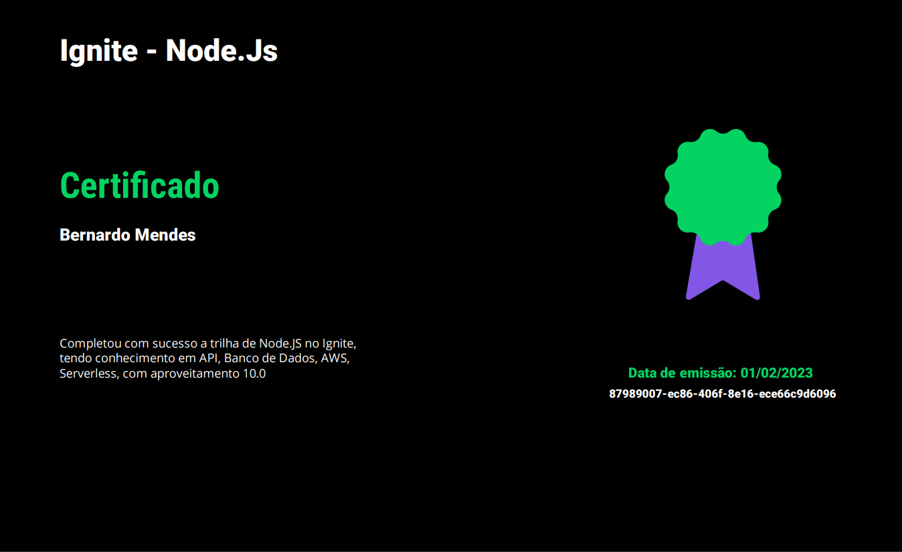

<h1 align="center">Node.js Serverless API - Course Certification Generator and Validator</h1>

This project was developed with the goal of structuring an API that could generate a course completion certification with a given student name and grade.

It has an additional functionality of checking if the id of the certification is valid.

<br/>
<h2>Libraries Used</h2>

#### Core Libraries

- [Serverless](https://www.serverless.com/)
- [Node.js](https://nodejs.org/en/)
- [AWS](https://aws.amazon.com/pt/sdk-for-javascript/)
- [DynamoDB](https://aws.amazon.com/pt/dynamodb/)

#### Utility Libraries

- [Typescript](https://www.typescriptlang.org/)
- [Handlebars](https://handlebarsjs.com/)
- [Day.js](https://day.js.org)

<br/>
<h2>Installation Instructions</h2>

Depending on your preferred package manager, follow the instructions below to deploy your project.

### Using NPM

- Run `npm i` to install the project dependencies
- Run `npx sls deploy` to deploy this stack to AWS

### Using Yarn

- Run `yarn` to install the project dependencies
- Run `yarn sls deploy` to deploy this stack to AWS
  
<br />
<h2>Deployment Instructions</h2>

### Local Deploy

> **Requirement**: NodeJS `lts/fermium (v.14.15.0)`. If you're using [nvm](https://github.com/nvm-sh/nvm), run `nvm use` to ensure you're using the same Node version in local and in your lambda's runtime.

> **Requirement**: Set the environment variables `AWS_BUCKET_NAME` and `AWS_BUCKET_URL` in the `.env` file and in the Lambda section.

- Run `yarn dynamodb:install`, `nmp run dynamodb:install` or `serverless dynamodb install` to install the dynamodb offline database in your local machine.
  
- Run `yarn dynamodb:start`, `nmp run dynamodb:start` or `serverless dynamodb start` to start the dynamodb offline database in your local machine.

- Run `yarn dev` or `npm run dev` to start the offline application locally.

<br>

### AWS Deploy

> **Requirement**: Set your AWS configuration keys by running `serverless config credentials --provider aws --key=<access_key> --secret=<secret_access_key>` on your folder terminal by replacing the `<access_key>` and `<secret_access_key>` variables with the respective key values of your IAM user.

> **Requirement**: Set the environment variables `AWS_BUCKET_NAME` and `AWS_BUCKET_URL` in the `.env` file and in the Lambda section. Read [this](https://docs.aws.amazon.com/lambda/latest/dg/configuration-envvars.html#configuration-envvars-config) article to learn how to configure your environment variables at AWS.

- Run `serverless deploy` to deploy your application to the AWS lambda service.

<br />
<h2>Endpoints Available</h2>

- `[POST] /dev/generateCertification` - Generates the certification.
- `[GET] /dev/validateCertification/{id}` - Validates the certification.

<br />
<h2>Project structure</h2>

The project code base is mainly located within the `src` folder. This folder is divided in:

- `functions` - containing code base and configuration for the lambda functions
- `templates` - containing the certification template 
- `utils` - containing shared utility functions and configuration

```
.
├── src
│   ├── functions                        # Lambda configuration and source code folder
│   │    ├── generateCertification.ts    # `generateCertification` lambda source code
│   │    └── verifyCertification.ts      # `verifyCertification` lambda source code
│   │
│   ├── utils                            # Utility folder
│   │   └── dynamodbClient.ts            # Database client manager
│   │
|   └── templates
│       └── certification.hbs            # Certification card template
|       └── selo.png                     # Certification stamp/seal
|
├── package.json
├── serverless.ts                        # Serverless service file
└── tsconfig.json                        # Typescript compiler configuration
```

<br />
<h2 align="right">Certification Preview</h2>

